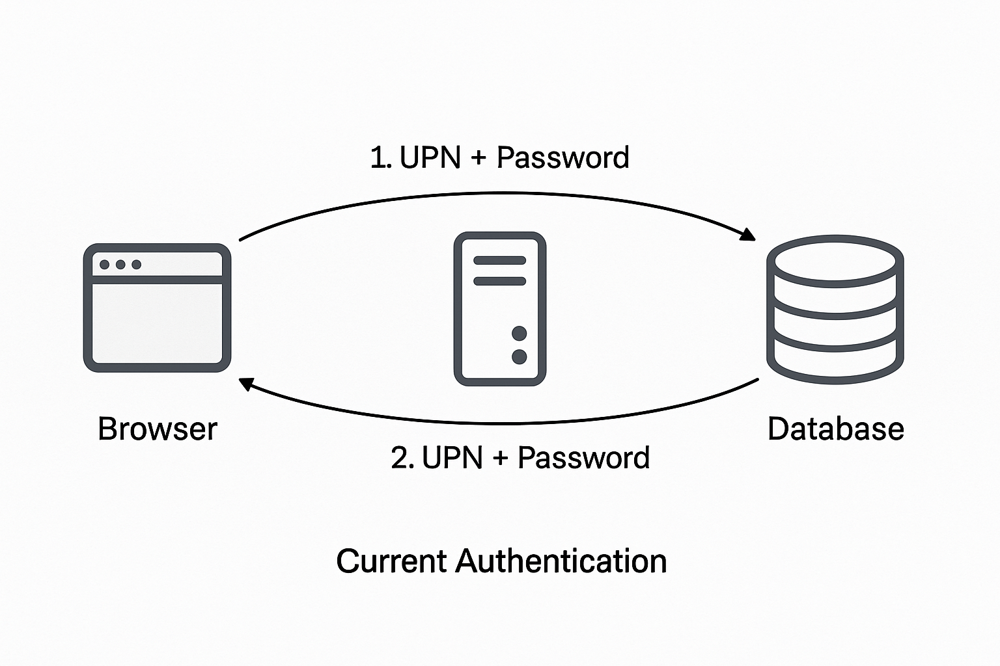

# Real Work Assignment – Solution Architect Mobile Products & Solutions (MPS)

## The current setup

### How the User is Authenticated (Step-by-Step)

#### 1. Login Page (Browser):

- The user enters their UPN (email) and password in a login form.

#### 2. Authentication (App Server):

- The server receives the credentials and queries the database.
- It verifies:
    - Whether the UPN exists
    - Whether the password matches (usually via hashed comparison)

#### 3. Session Creation:
- If the credentials are valid, the app creates a session (often stored in memory, a session store, or database).
- It generates a session ID.

#### 4. Session Token to Client:
- The session ID is sent to the browser as a cookie (usually Set-Cookie header).
- This cookie is saved in the browser.

### How the App Knows the User on Other Pages

Every time the user visits another page or makes an API request:

#### 1. The browser automatically sends the session cookie with the request.

#### 2. The app server:
- Reads the session ID from the cookie.
- Looks it up in the session store or in-memory map.
- Retrieves the associated user identity and role.

#### 3. The app uses that to:
- Authorize access to specific pages or actions.
- Personalize the response (e.g., show user's name, role, etc.).

###  How the Session Expires

There are typically two types of expiration mechanisms in place:

#### 1. Inactivity Timeout (Idle Timeout)

- The session expires after a period of inactivity — e.g., 15 or 30 minutes.
- Every time the user makes a request, the session's "last activity timestamp" is updated.
- If no requests are made for the duration of the timeout, the session is removed or marked invalid.

📌 Why?
- Protects against attacks if the user walks away from their computer or forgets to log out.

#### 2. Absolute Timeout (Fixed Lifetime)

- The session is set to expire after a fixed amount of time, regardless of activity — e.g., 8 hours or 24 hours.
- Once that time passes, the user is forced to re-authenticate.

📌 Why?
- Limits long-lived sessions, which is important for reducing the attack surface if credentials or session cookies are stolen.

### Drawbacks of the current authentication setup

The current authentication setup uses the same database for :
- Application data (e.g., customer records, admin actions, settings)
- User authentication data (e.g., usernames, hashed passwords, roles)

Using the same database for both application and identity/authentication data can introduce security and architectural concerns:

#### 1. Increased Attack Surface

If attackers exploit a vulnerability in the app (e.g. SQL injection, XSS, or privilege escalation), they might:
- Access both the application data and the user credentials
- Potentially extract or tamper with sensitive login information

#### 2. Tight Coupling

- Mixing authentication with business logic makes it harder to scale, troubleshoot, or migrate to modern identity solutions
  (e.g. Identity-as-a-Service like Azure AD, Auth0, etc.)
- No clear separation of concerns (e.g., identity vs. business logic)

#### 3. Lack of Central Identity Management

- Each application manages its own user accounts
- No centralized access controls, policies, or audit trails
- Difficult to implement single sign-on (SSO) or multi-factor authentication (MFA)